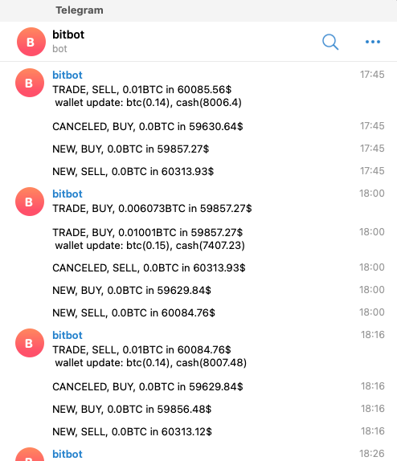

This is a trader Bot for Bitcoin.

#### disclaimer
Although it's completely functional, keep in mind that I've made this as a fun and also basis for data analysis project.)

#### how to connect it to my Binance API (and how safe it is?)
It uses your Binance wallet API key to trade on your behalf.
You can easily run it trade for you, only you need some parameters justification based on your risk level, and expectations.

#### how to connect it to my telegram
for this trader bot to send trade updates to you on telegram take these steps:

- in your telegram go to https://telegram.me/BotFather
- hit start, choose a name, then choose a username
- BotFather will give you a token
- on your server install telegram-send: pip install telegram-send
- after installing telegram-send, configure that: telegram-send --configure
- it asks you for the token you got in step 3 and gives you a password that you need to send in telegram to the bot
- now you're done
